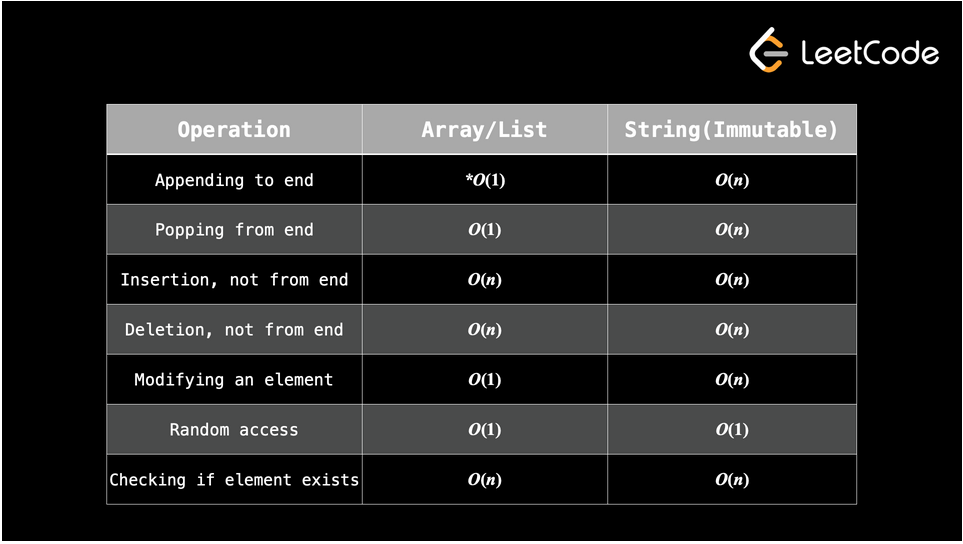

# Arrays and Strings

## Summary

Arrays and strings are some of the most common inputs for types of problems. In this section we will identify some of the optimal ways to work with strings and arrays targeting time and space complexity.

## Operation Runtimes

