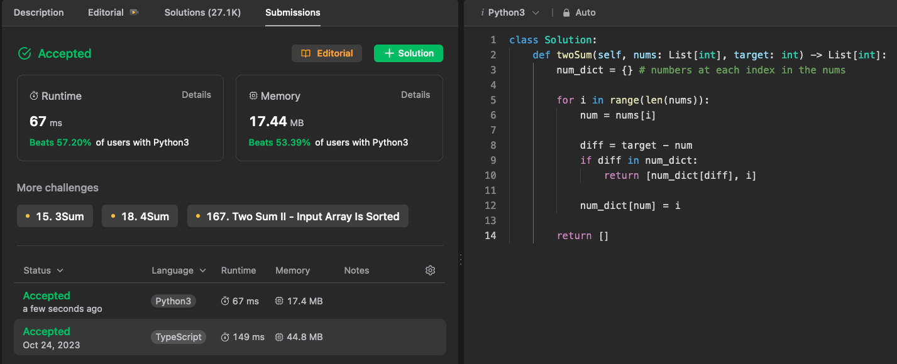

# Checking for existance

Hash tables or sets can greatly reduce the amount of time complexity-in some worse cases from O(n) or O(n ^ 2)-down to O(1) for checking whether a value exists or not in the collection. For example

## Example 1: Two Sum

```python
# given an array of integers nums and an integer target, return indices of two numbers such that they add up to target. You cannot use the same index twice.
# see https://leetcode.com/problems/two-sum/

def two_sum(nums: list[int], target: int) -> list[int]:
    num_dict = {} # numbers at each index in the nums
    
    for i in range(len(nums)):
        num = nums[i]
        
        diff = target - num
        if diff in num_dict:
            return [num_dict[diff], i]
        
        num_dict[num] = i

    return []
```




## Example 2: First Letter to Appear Twice

See: https://leetcode.com/problems/first-letter-to-appear-twice/

```python
class Solution:
    def repeatedCharacter(self, s: str) -> str:
        seen = set()

        for char in s:
            if char in seen:
                return char

            seen.add(char)

        return None
```


